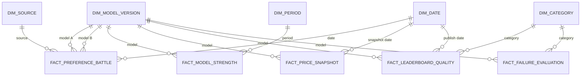

# BigQuery schema

```mermaid
erDiagram
    DIM_MODEL_VERSION ||--o{ FACT_PREFERENCE_BATTLE : "model A"
    DIM_MODEL_VERSION ||--o{ FACT_PREFERENCE_BATTLE : "model B"
    DIM_DATE ||--o{ FACT_PREFERENCE_BATTLE : "date"
    DIM_SOURCE ||--o{ FACT_PREFERENCE_BATTLE : "source"

    DIM_MODEL_VERSION ||--o{ FACT_MODEL_STRENGTH : "model"
    DIM_PERIOD ||--o{ FACT_MODEL_STRENGTH : "period"

    DIM_MODEL_VERSION ||--o{ FACT_PRICE_SNAPSHOT : "model"
    DIM_DATE ||--o{ FACT_PRICE_SNAPSHOT : "snapshot date"

    DIM_MODEL_VERSION ||--o{ FACT_LEADERBOARD_QUALITY : "model"
    DIM_DATE ||--o{ FACT_LEADERBOARD_QUALITY : "publish date"
    DIM_CATEGORY ||--o{ FACT_LEADERBOARD_QUALITY : "category"

    DIM_MODEL_VERSION ||--o{ FACT_FAILURE_EVALUATION : "model"
    DIM_CATEGORY ||--o{ FACT_FAILURE_EVALUATION : "category"
```